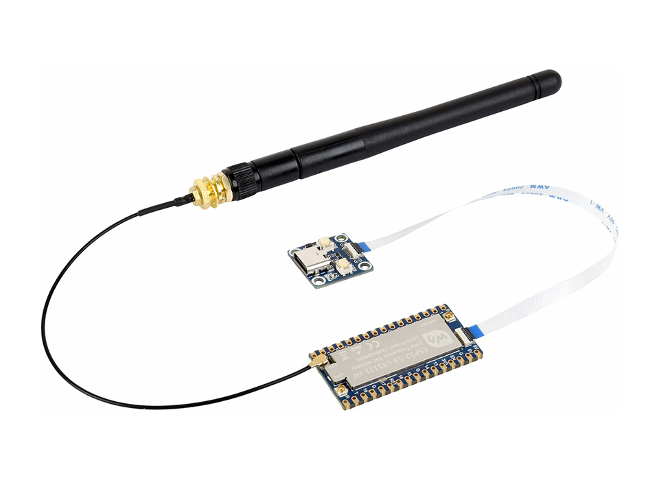

ESP32-S3-LR1121-XF Product Engineering Sample Program

ESP32-S3-LR1121-XF integrates high-performance Wi-Fi, Bluetooth and LoRa connectivity, supporting Sub-GHz, S-band and 2.4 GHz communication. It enables rapid development of low-power, long-range IoT applications.

🔧 Configuration

You can find detailed configuration information on the product wiki page

🛠️ Contributing

We welcome contributions! Here’s how you can help:

Fork the repository.
Create a new branch for your feature or bug fix.
Commit your changes with clear descriptions.
Submit a pull request for review.

🧩 Issues and Support

If you encounter any issues:

Check the Issues section.
Create a new issue with detailed information.
Refer to the documentation for troubleshooting tips.
Contact the Waveshare team and provide the order number to obtain technical support.

📜 License

This repository is licensed under the Apache License License. See the LICENSE file for details.

🙌 Acknowledgments

Waveshare for their excellent hardware platforms and software support
The Espressif Team for their continuous support.
Open-source contributors who make these projects possible.

Thank you for using Waveshare Electronics Products! 🚀
